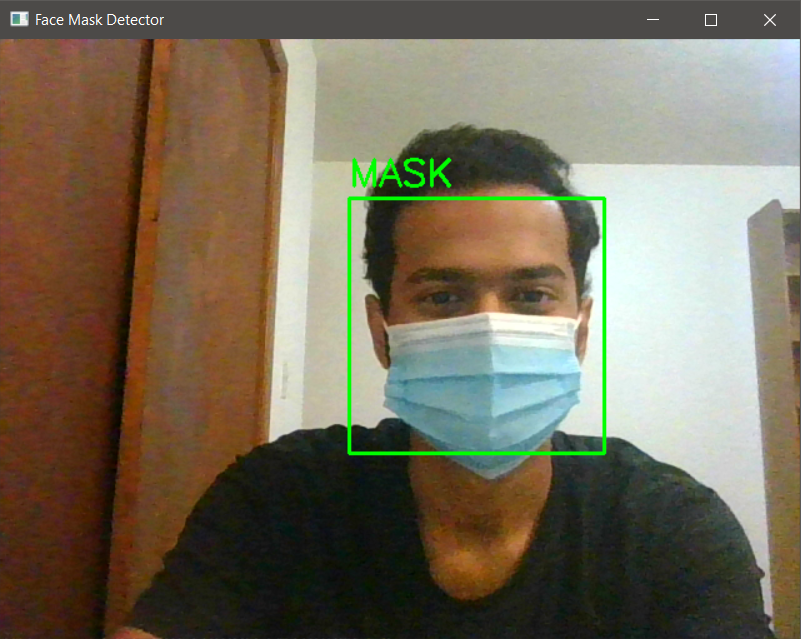
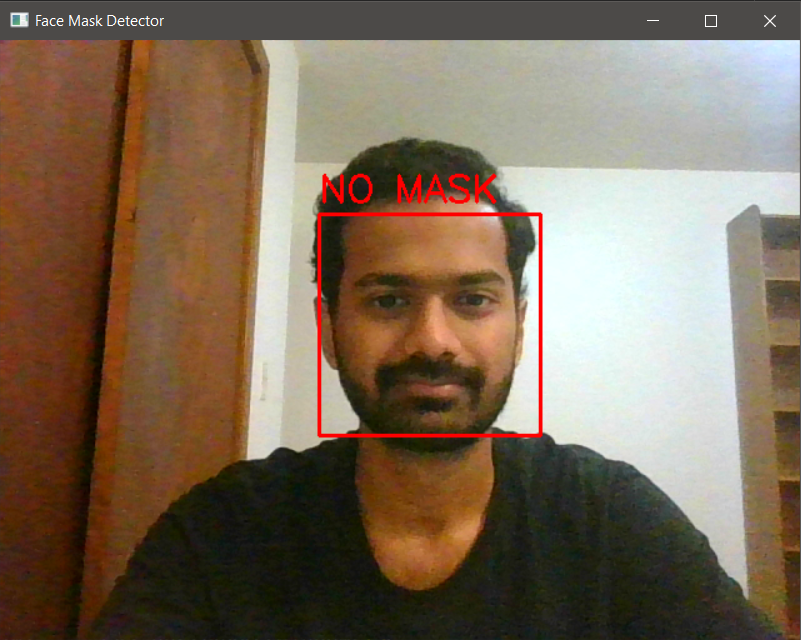

# Face Mask Detection using Transfer Learning (VGG19)

This project detects face masks in images and live video feeds. Currently, the code is set up to input computer's webcam feed. Dataset used for training has been obtained from <a href='https://www.kaggle.com/ashishjangra27/face-mask-12k-images-dataset'>here</a>.

## Training Model

The model VGG19 has been trained to detect mask on a face. Learn more about Transfer Learning <a href='https://machinelearningmastery.com/how-to-use-transfer-learning-when-developing-convolutional-neural-network-models/'>here</a>.

## Detecting Faces

To detect faces in an image or a frame of a video, we use <a href = 'https://github.com/opencv/opencv/tree/master/data/haarcascades'>haar cascade</a>'s frontal face default xml file.

## Predicting on image/livefeed

For an image, we simply extract all the faces from it and evaluate the faces using the model to predict whether it has a mask on it. For a video feed, we go through each frame to detect all the faces in it and evaluate each face detected with the model.

## Results

### With Mask

### Without Mask

